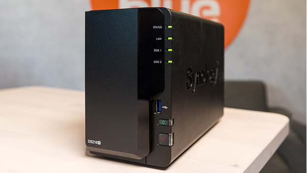
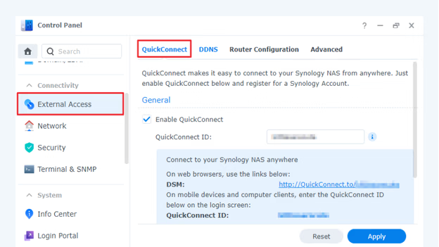

# Accessing Your Synology NAS Externally via QuickConnect

QuickConnect allows you to access your Synology NAS remotely without complex router configurations. Follow these steps to set up QuickConnect and securely connect to your NAS from anywhere.

## Prerequisites

Ensure you have the following:

- **Synology NAS**: Properly set up and connected to your network.
- **Desktop or Laptop**: Connected to the internet.
- **Stable Internet Connection**: For both your NAS and the device you'll use to access it.

## Step 1: Set Up QuickConnect on Your NAS

The setup process varies depending on your DiskStation Manager (DSM) version.

### For DSM 7.0 and Above:

1. **Access Control Panel**:
   - Log in to your Synology NAS.
   - Click on the **Control Panel**.

2. **Navigate to External Access**:
   - Under the **Connectivity** section, select **External Access**.

3. **Enable QuickConnect**:
   - Go to the **QuickConnect** tab.
   - Check the box labeled **Enable QuickConnect**.

4. **Sign In or Register**:
   - If you don't have a Synology account, you'll be prompted to create one.
   - If you have an account, log in with your credentials.

### For DSM 6.2 and Below:

1. **Access Control Panel**:
   - Log in to your Synology NAS.
   - Click on the **Control Panel**.

2. **Enable QuickConnect**:
   - At the top of the page, check the box labeled **Enable QuickConnect**.

3. **Sign In or Register**:
   - If you don't have a Synology account, you'll be prompted to create one.
   - If you have an account, log in with your credentials.

## Step 2: Create a QuickConnect ID

1. **Enter a User Name**:
   - After enabling QuickConnect, enter a unique QuickConnect ID in the field provided below the checkbox.

2. **Apply Settings**:
   - Agree to the privacy policy by checking the appropriate box.
   - Click **Apply**.

3. **Confirm Availability**:
   - If your chosen ID is available, you'll see a confirmation along with the address to access your DSM remotely.

4. **Advanced Settings (Optional)**:
   - To configure additional options or permissions, navigate to **Advanced Settings** (for DSM 7.0 and above) or the **Advanced** tab (for DSM 6.2 and below).

## Step 3: Connect Your Device via QuickConnect

### From a Desktop or Laptop:

1. **Open a Web Browser**:
   - On your computer, launch your preferred web browser.

2. **Enter QuickConnect URL**:
   - In the address bar, type `http://quickconnect.to/YourQuickConnectID`, replacing `YourQuickConnectID` with the ID you created.
   - Press **Enter** to navigate to the login screen.

3. **Log In**:
   - Enter your DSM account credentials to access your NAS.

### From a Smartphone:

1. **Install Synology App**:
   - Download and install a Synology-certified app, such as **DS File**, from your device's app store.

2. **Configure Connection**:
   - Open the app and enter your QuickConnect ID, DSM account, and password.

3. **Log In**:
   - Tap **Log In** to connect to your NAS.

## Step 4: Secure Your NAS Connection

To enhance the security of your NAS, consider implementing the following measures:

1. **Enable Auto Block**:
   - This feature blocks IP addresses with multiple failed login attempts.
   - In DSM, navigate to **Control Panel** > **Security** > **Account**.
   - Check the box labeled **Enable Auto Block** and configure the settings as desired.

2. **Set Up Account Protection**:
   - Protect user accounts from unauthorized access.
   - In **Control Panel** > **Security** > **Account**, enable **Account Protection** and define the rules.

3. **Create an HTTPS Certificate**:
   - Ensure secure communication by using HTTPS.
   - In **Control Panel** > **Security** > **Certificate**, create or import an SSL certificate.

4. **Enable Firewall**:
   - Prevent unauthorized access by configuring the firewall.
   - In **Control Panel** > **Security** > **Firewall**, enable the firewall and set up rules to allow or deny specific traffic.

By following these steps, you can securely access your Synology NAS from anywhere using QuickConnect.

