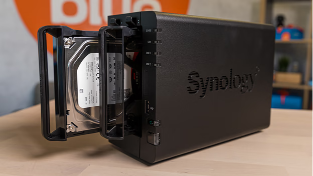
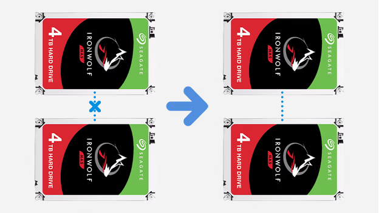
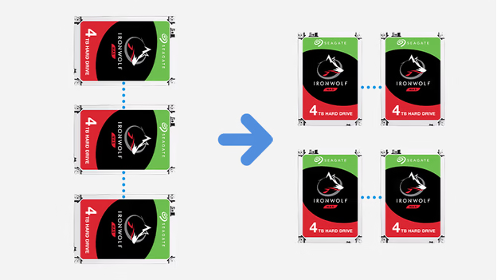

# Adjusting the RAID Setup on Your Synology NAS

Configuring a RAID (Redundant Array of Independent Disks) setup on your Synology NAS enhances data protection and performance by combining multiple hard drives into a single storage system. This guide outlines how to create a new RAID setup, modify an existing one, or restore a previous configuration.

## Understanding RAID

RAID setups allow you to combine multiple hard drives to improve performance and safeguard against data loss. Different RAID levels offer varying balances between speed, redundancy, and storage capacity. 

## Option 1: Creating a New RAID Setup

**Important:** Creating a new RAID setup will erase all data on the selected disks. Ensure you back up any important data before proceeding.

1. **Access Synology DiskStation Manager (DSM):**
   - Open a web browser on a computer connected to the same network as your NAS.
   - Navigate to [find.synology.com](http://find.synology.com) to locate and access your NAS interface.

2. **Open Storage Manager:**
   - Click on the **Main Menu** in the top-left corner.
   - Select **Storage Manager** from the dropdown.

3. **Create a Storage Pool:**
   - In the left-hand menu, click on **Storage Pool**.
   - Click the **Create** button.
   - Choose between **Better Performance** (for a single volume with faster file transfer) or **Higher Flexibility** (for multiple volumes).
   - Select your desired RAID type based on the number of available drives:
     - **Basic or JBOD:** Minimum 1 drive
     - **RAID 0 or RAID 1:** Minimum 2 drives
     - **Synology Hybrid RAID (SHR):** Minimum 2 drives
     - **RAID 5:** Minimum 3 drives
     - **RAID 6 or RAID 10:** Minimum 4 drives
     - **SHR-2:** Minimum 4 drives
   - Select the hard drives to include in the RAID setup.
   - Review your selections and click **Apply**.

4. **Create a Volume:**
   - In **Storage Manager**, navigate to the **Volume** section.
   - Click **Create** and follow the wizard:
     - Choose **Existing Storage Pool**.
     - Specify the volume size and other settings.
     - Click **Apply** to finalize the configuration.

## Option 2: Modifying an Existing RAID Setup

Certain RAID configurations allow for migration to a different RAID type without data loss. The following transitions are supported:

- **Basic or JBOD to RAID 1:** Requires adding at least 1 additional drive.
- **Basic or JBOD to RAID 5:** Requires adding at least 2 additional drives.
- **RAID 1 to RAID 5:** Requires adding at least 1 additional drive.
- **RAID 5 to RAID 6:** Requires adding at least 1 additional drive.
- **SHR to SHR-2:** Requires adding at least 2 additional drives.

**Steps to Modify RAID Configuration:**

1. **Access Storage Manager:**
   - Log in to DSM and open **Storage Manager**.

2. **Select Storage Pool:**
   - Click on **Storage Pool** and select the pool you wish to modify.

3. **Change RAID Type:**
   - Click **Action** and select **Change RAID Type**.
   - Follow the wizard to select the new RAID type and add the necessary drives.
   - Confirm the changes and click **Apply**.

**Note:** Ensure that the new RAID configuration is supported by your NAS model and that you have sufficient drives installed.

## Option 3: Restoring a Previous RAID Setup

**Warning:** Restoring a RAID setup will delete all existing data on the disks. Back up important data before proceeding.

1. **Access Storage Manager:**
   - Log in to DSM and open **Storage Manager**.

2. **Delete Existing Storage Pool:**
   - In **Storage Pool**, select the pool to delete.
   - Click **Action** and choose **Remove**.
   - Confirm the deletion.

3. **Create New RAID Setup:**
   - Follow the steps outlined in **Option 1** to create a new RAID configuration.

