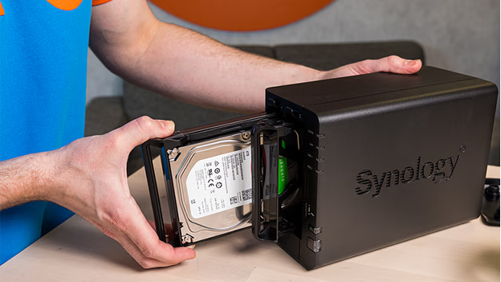
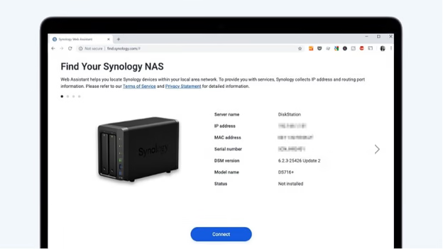
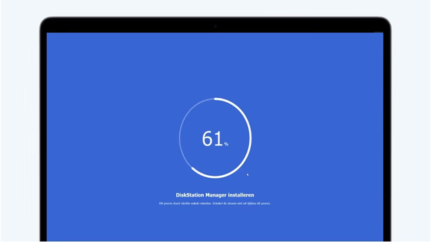
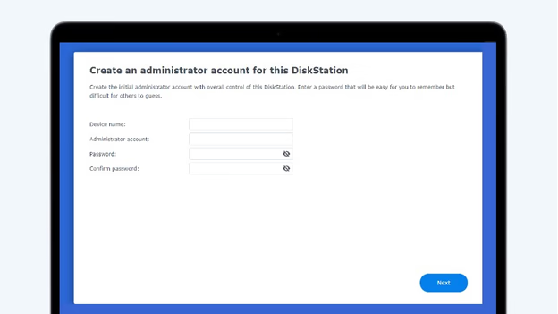
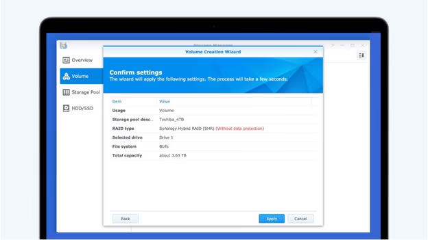
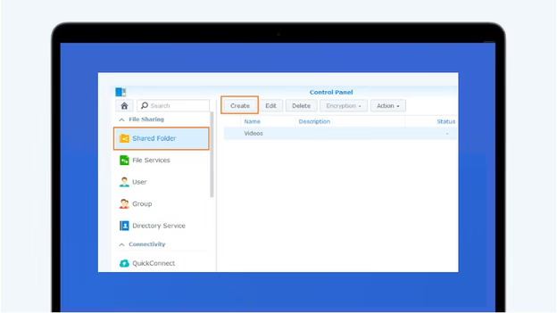

# How to Install Your Synology NAS

Setting up your Synology NAS is straightforward. Follow these steps to get started:

## Step 1: Install the Hard Drives

1. **Access Drive Bays**: Locate the drive bays at the front of your Synology NAS. Some models have a removable front panel.
2. **Insert Drives**:
   - **Remove Drive Tray**: Pull out the drive tray.
   - **Mount Drive**: Place your hard drive into the tray and secure it. For 2.5-inch drives, use screws as indicated.
   - **Reinsert Tray**: Slide the loaded tray back into the NAS.
3. **Repeat**: If using multiple drives, repeat the process for each.

## Step 2: Connect to the Network

1. **Power On**: Turn on your NAS.
2. **Network Connection**: Use an Ethernet cable to connect the NAS to your router for a stable connection.
3. **Access via Browser**:
   - On a computer connected to the same network, open a web browser.
   - Navigate to [find.synology.com](http://find.synology.com).
   - Your NAS should appear; click 'Connect' to proceed.

## Step 3: Install DSM (DiskStation Manager)

1. **Start Installation**: After connecting, click 'Install' to begin setting up the DSM software.
2. **Automatic Installation**:
   - Select the automatic installation option.
   - **Note**: This process will erase all data on the installed drives.
   - Click 'Next' and then 'Confirm' to proceed.
3. **Wait**: The installation will take approximately 10 minutes.

## Step 4: Configure System Settings

1. **Device Name**: Assign a name to your NAS; this will be visible on your network.
2. **Administrator Account**:
   - Create an admin username and a strong password.
   - Store these credentials securely.
3. **Update Preferences**: Choose your preferred update settings:
   - **Automatic Updates**: Recommended for essential DSM and package updates.
   - **Manual Updates**: If you prefer to control the update process.
4. **Finalize**: Complete the setup to access the DSM desktop.

## Step 5: Set Up Storage Pool and Volume

1. **Open Storage Manager**: In the DSM, navigate to 'Storage Manager'.
2. **Create Volume**:
   - Click on the 'Volume' tab and select 'Create'.
   - **Setup Type**: Choose 'Better Performance' for a single volume or 'Higher Flexibility' for multiple volumes.
   - **RAID Configuration**: For automatic setup, Synology Hybrid RAID (SHR) is recommended.
   - **Select Drives**: Choose the drives to include in the volume.
   - **File System**: Opt for Btrfs for advanced features.
3. **Initialize**: Proceed with the setup. The NAS will perform a parity check but remains usable during this process.

## Step 6: Create Shared Folders

1. **Access Control Panel**: Go to the 'Control Panel' in DSM.
2. **Shared Folder**:
   - Click on 'Shared Folder' and then 'Create'.
   - **Name and Description**: Enter a name and description for the folder.
   - **Volume Selection**: Choose the appropriate volume.
   - **Permissions**: Set user access rights as needed.
3. **Finalize**: Complete the creation process.

## Step 7: Enable External Access

1. **QuickConnect Setup**:
   - In the 'Control Panel', navigate to 'External Access' under 'Connectivity'.
   - Go to the 'QuickConnect' tab and enable QuickConnect.
   - **Synology Account**: Sign in or create a Synology account if prompted.
   - **QuickConnect ID**: Create a unique ID for remote access.
2. **Access Your NAS Remotely**:
   - On external devices, use the QuickConnect ID to access your NAS via Synology's mobile apps or through a web browser.

By following these steps, your Synology NAS will be set up and ready to use. For more detailed instructions, refer to Synology's official documentation.

