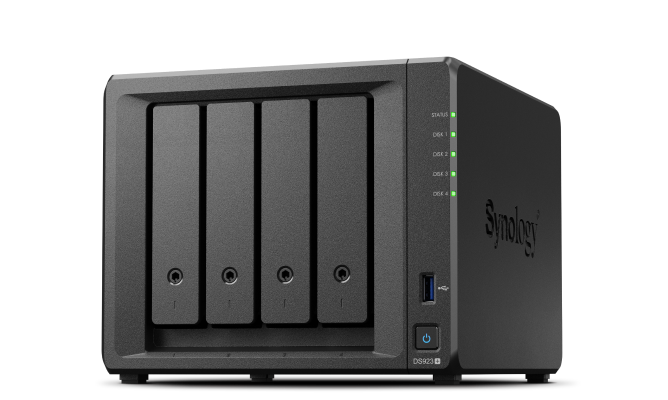
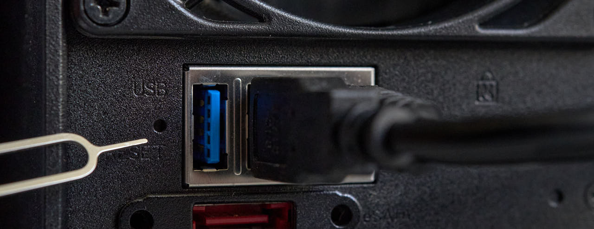

# How to Reset Your Synology NAS

Resetting your Synology NAS may be necessary for various reasons, such as forgetting your login information or wanting to restore factory settings. There are two methods available for resetting your Synology NAS: a **soft reset** and a **hard reset**. This guide explains when to use each method and provides step-by-step instructions.

## Before You Start
### What You Need:
- A **Synology NAS** device.
- A **pen** or **paperclip** to access the reset button.
- The NAS powered on (blue power LED and green status LED).

### Things to Keep in Mind:
- **Data Safety**: Neither method will delete your stored photos or files. However, it's recommended to back up your data regularly for added security.

## Reset Methods
### 1. Soft Reset
A soft reset restores user account and network settings. This is useful if you’ve forgotten your login information.

**Steps for a Soft Reset:**
1. Use a pen or paperclip to press and hold the reset button at the back of the NAS for **4 seconds** (the button is located in a small round hole near the USB or Ethernet ports).
2. Release the button when you hear a beep, and the NAS will reboot.
3. Open Synology Web Assistant by visiting [http://find.synology.com](http://find.synology.com) in a web browser on a computer connected to the same network as the NAS.
4. Set a new password for your account and store it securely.
5. Follow the on-screen setup steps to complete the configuration.

### 2. Hard Reset
A hard reset deletes the Synology DiskStation operating system (DSM). Your data remains intact, but the NAS must be reconfigured afterward.

**Steps for a Hard Reset:**
1. Use a pen or paperclip to press and hold the reset button at the back of the NAS for **4 seconds**, then release when you hear a beep.
2. Within **10 seconds**, press and hold the reset button again until you hear a **longer beep**.
3. The NAS will reboot and emit another beep once it’s ready for setup.
4. Open Synology Web Assistant by visiting [http://find.synology.com](http://find.synology.com) in a web browser on a computer connected to the same network as the NAS.
5. Follow the on-screen setup steps to reinstall and configure the NAS.

By following the appropriate method for your situation, you can reset your Synology NAS and restore functionality with ease.
