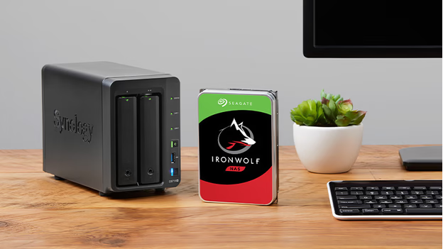
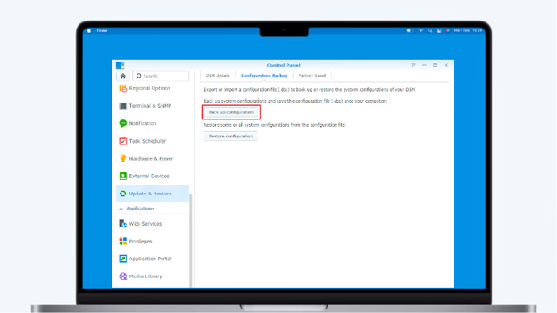
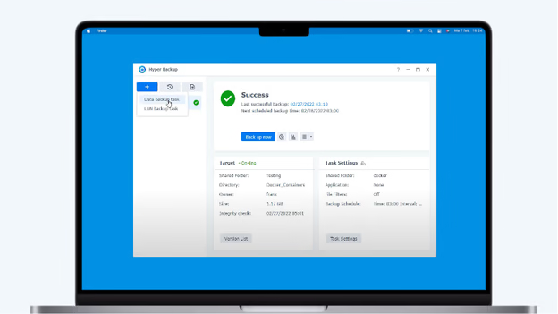
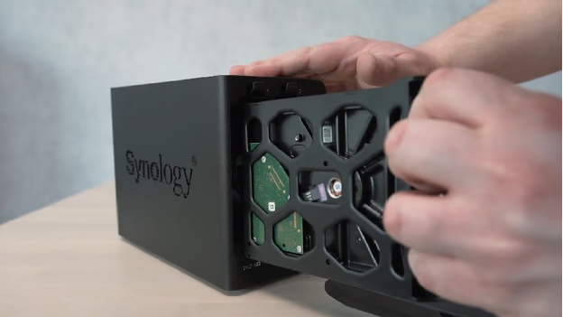
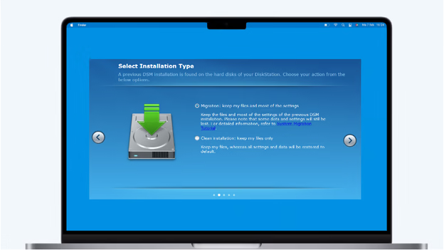
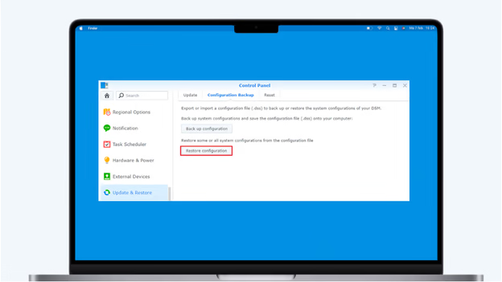
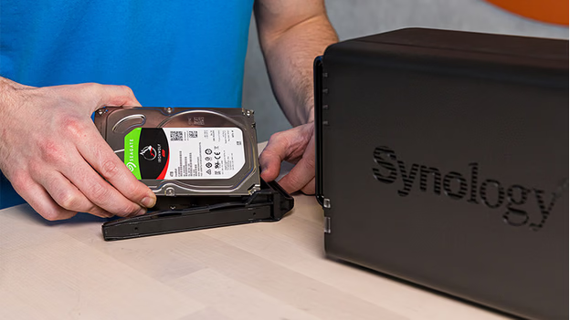

# How to Transfer Hard Drives Between Synology NAS Devices

Transferring hard drives from one Synology NAS to another involves more than simply moving the disks. Compatibility checks, backups, and proper setup are essential to ensure a smooth transition. Follow these steps to migrate your drives effectively.

---

## Prerequisites

- **Devices Needed**:
  - Current Synology NAS
  - New Synology NAS
  - Laptop or desktop computer
  - Router connecting your NAS devices and computer
  - Internal hard drives (plus an extra temporary hard drive for backups)

---

## Steps to Transfer Your Hard Drives

### 1. Check Drive Compatibility

Before transferring, ensure your hard drives are compatible with the new Synology NAS model.

- **Identical NAS Models**: If the new NAS is the same model as the old one, proceed to the next step.
- **Different NAS Models**: Consult Synology's [HDD/SSD compatibility list](https://www.synology.com/en-us/compatibility) to verify compatibility. Generally, Seagate IronWolf or WD Red drives are compatible with Synology NAS devices manufactured after 2015. For HDDs exceeding 8TB, ensure compatibility with NAS models released after 2021.

### 2. Back Up Your Settings

Preserve your current NAS configuration by backing up its settings.

1. Log in to your old NAS and open the **Control Panel**.
2. Navigate to **Update & Restore**.
3. Ensure your NAS is running the latest DSM version; update if necessary.
4. Go to the **Configuration Backup** tab.
5. Click **Backup** and save the configuration file to a secure location.

*Tip*: Use a temporary external hard drive to store this backup.

### 3. Back Up Your Data

While migrating drives typically retains data, creating a backup is a prudent precaution.

1. Install the **Hyper Backup** app from the Synology Package Center.
2. Open Hyper Backup and click the **+** icon to create a new backup task.
3. Select **Remote NAS device** as the destination.
4. Enter the server name or IP address of your new NAS (find this via [find.synology.com](http://find.synology.com)).
5. Choose the folders and applications to back up, then click **Done**.
6. Allow Hyper Backup to complete the process.
7. Once finished, power off both NAS devices.
   

### 4. Transfer Your Hard Drives

With both NAS devices powered off:

1. Remove the hard drives from your old NAS.
2. Note the order of the drives; maintaining the same order in the new NAS is crucial.
3. Insert the drives into the new NAS in the same sequence.
4. Power on the new NAS.

### 5. Install the Hard Drives

1. On your computer, open a web browser and navigate to [find.synology.com](http://find.synology.com).
2. Locate your new NAS and ensure its status is **Migratable**.
3. Click **Install** and select the **Migration** option during the installation process.
   - If you receive a warning stating that all data will be deleted, power off the NAS and verify that the drives are inserted in the correct order before retrying.

### 6. Set Up the New NAS

1. During setup, opt to install the latest DSM version.
2. After installation, log in to your new NAS.
3. Open the **Control Panel** and go to **Update & Restore**.
4. Click **Restore Configuration** and upload the settings backup file from Step 2.
5. Complete the setup process.

## Transferring Drives from a Defective NAS

If your old NAS is defective, you can transfer the drives to an identical model:

1. Insert a temporary hard drive into the new NAS.
2. Install the same DSM version as was on your old NAS via [find.synology.com](http://find.synology.com).
3. Power off the NAS and replace the temporary drive with your original drives, maintaining the correct order.
4. Power on the NAS and log in.

By following these steps, you can successfully migrate your hard drives to a new Synology NAS, ensuring data integrity and system continuity.
