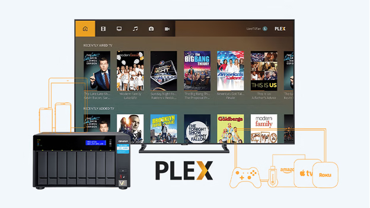
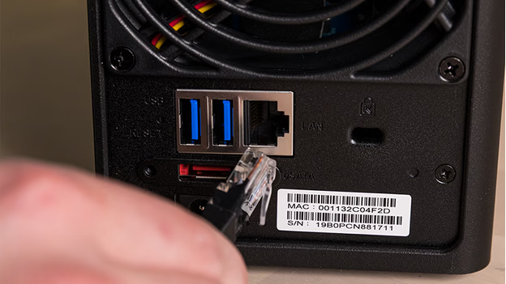
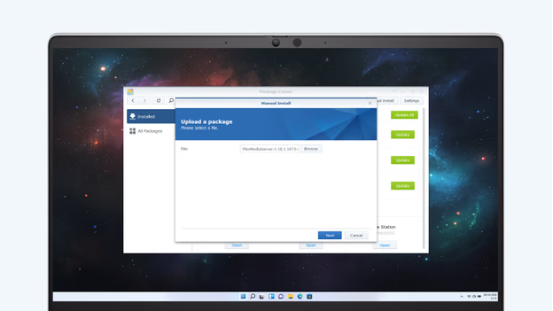
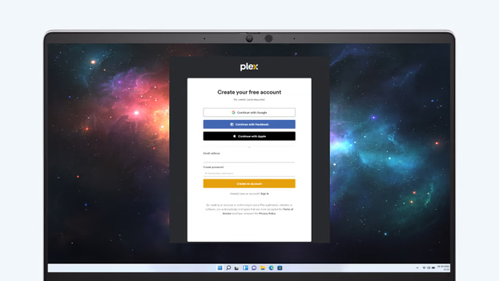
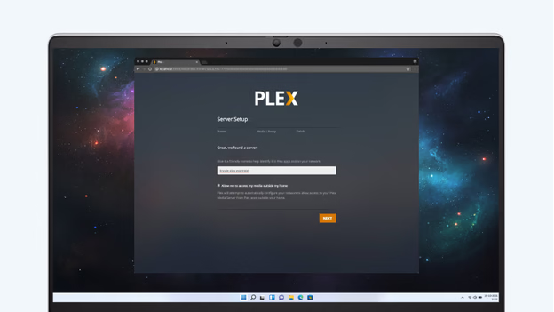
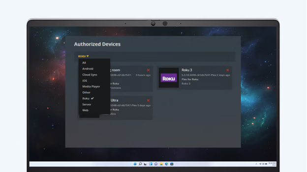

---
title:Installing Plex on Your Synology NAS
---

# Installing Plex on Your Synology NAS

Plex is a versatile application that transforms your Synology NAS into a powerful media server, allowing you to stream movies, series, music, and more to various devices. Follow these steps to install and configure Plex on your Synology NAS.

## Prerequisites

Ensure you have the following:

- **Synology NAS**: Properly set up and connected to your network.
- **Stable Internet Connection**: For downloading and installing packages.
- **Computer**: Connected to the same network as your NAS.
- **Router**: Connecting your NAS and computer.

## Step 1: Install Plex via Synology Package Center

1. **Access Synology DSM**:
   - On your computer, open a web browser and navigate to [find.synology.com](http://find.synology.com).
   - Locate your NAS and click 'Connect' to access the DiskStation Manager (DSM).

2. **Open Package Center**:
   - In the DSM interface, click the **Main Menu** (grid icon) in the top-left corner.
   - Select **Package Center** from the dropdown.

3. **Search for Plex**:
   - Use the search bar in the top-right corner of the Package Center and type 'Plex'.
   - Locate **Plex Media Server** in the results.

4. **Install Plex**:
   - Click the **Install** button next to Plex Media Server.
   - Wait approximately 5 minutes for the installation to complete.

5. **Launch Plex**:
   - After installation, return to the **Main Menu** and click the **Plex** icon to launch the application.

## Step 2: Register and Configure Plex

1. **Create a Plex Account**:
   - Upon launching Plex, a new browser window will open.
   - Click **Sign Up** to create a new account, or **Sign In** if you already have one.
   - Provide a valid email address, username, and password.
   - Keep your login credentials secure for future access.

2. **Name Your Server**:
   - After logging in, you'll be prompted to name your Plex server.
   - Choose a descriptive name that helps you identify the server on your network.

3. **Enable Remote Access (Optional)**:
   - If you wish to access your media library outside your local network, check the box labeled **Enable Remote Access**.
   - This allows streaming your content remotely, such as when you're away from home.

## Step 3: Create Media Libraries

1. **Add Libraries**:
   - In the Plex web interface, click **Add Library**.
   - Select the type of media (e.g., Movies, TV Shows, Music) you want to add.

2. **Specify Media Folders**:
   - A prompt will appear to browse and select the folders on your NAS where your media files are stored.
   - Repeat this process for each type of media you wish to include.

3. **Organize Content**:
   - Ensure that movies, series, and other media types are stored in separate folders for better organization.
   - This structure helps Plex accurately fetch metadata and display your library correctly.

## Step 4: Set Up Devices

1. **Install Plex App**:
   - On each device you plan to use (smartphone, tablet, smart TV, etc.), download and install the Plex app from the respective app store.

2. **Log In to Plex**:
   - Open the Plex app on your device.
   - Sign in with the Plex account credentials you created earlier.

3. **Connect to Your Server**:
   - Upon logging in, the app will detect your Plex server.
   - Select your server to access your media libraries.

4. **Manage Connected Devices**:
   - In the Plex web interface, go to **Settings** and select **Authorized Devices**.
   - Here, you can view all devices connected to your Plex server.
   - To remove a device, click the red 'X' next to its name.
   - Devices can be reauthorized by logging back into your Plex account on them.

By following these steps, you'll have Plex installed on your Synology NAS, enabling seamless streaming of your media collection across all your devices.
