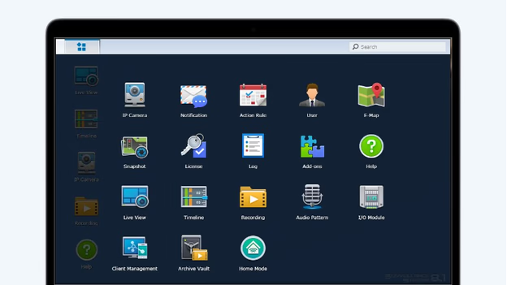
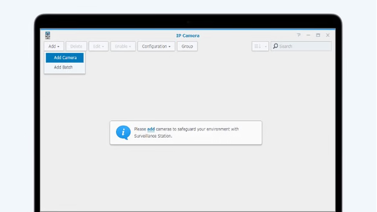
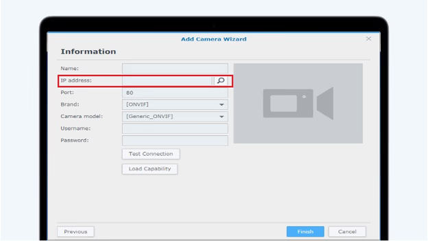
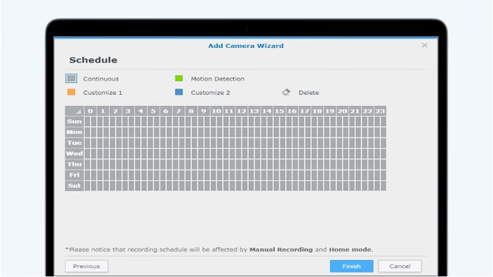
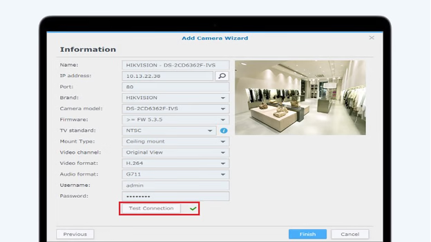

# Recording IP Camera Footage with Your Synology NAS

Synology's Surveillance Station allows you to connect IP cameras to your NAS, enabling live streaming and recording of footage. Follow these steps to set up and configure your system.

<iframe width="560" height="315" src="https://www.youtube.com/embed/dReT37WcQsU?si=A0iUZxAmJq3hgybB&amp;controls=0" title="YouTube video player" frameborder="0" allow="accelerometer; autoplay; clipboard-write; encrypted-media; gyroscope; picture-in-picture; web-share" referrerpolicy="strict-origin-when-cross-origin" allowfullscreen></iframe>

## Prerequisites

Ensure you have the following:

- **Synology NAS**: Properly set up and connected to your network.
- **Internal Hard Drives**: Installed in your NAS to store recordings.
- **Compatible IP Camera**: Connected to the same network as your NAS.
- **Computer**: For configuration purposes.
- **Router**: Connecting your NAS, IP camera, and computer.

## Step 1: Install Synology Surveillance Station

1. **Access Package Center**:
   - Log in to your Synology NAS via a web browser.
   - Open the **Package Center** from the main menu.

2. **Install Surveillance Station**:
   - Search for **Surveillance Station**.
   - Click **Install** and wait for the installation to complete.
   - Once installed, launch Surveillance Station from the main menu.

## Step 2: Connect the IP Camera to Your NAS

1. **Open IP Camera Interface**:
   - In Surveillance Station, navigate to **IP Camera**.

2. **Add Camera**:
   - Click **Add** to launch the Camera Wizard.
   - Choose between **Quick Setup** (basic settings) or **Complete Setup** (advanced settings).
   - Select the desired setup option and click **Next**.

## Step 3: Enter Camera Information

1. **Detect Camera**:
   - Click the magnifying glass icon next to **IP Address** to auto-detect available cameras.
   - Select your camera from the list and click **OK**.

2. **Configure Settings**:
   - Ensure the camera's IP address, port, username, and password are correctly entered.
   - Disable any extra functions like firmware updates or UPnP on the camera if necessary.

3. **Test Connection**:
   - Click **Test Connection** to verify the setup.
   - A green checkmark and live video feed indicate a successful connection.

## Step 4: Review and Adjust Settings

1. **Video Settings** (Complete Setup Only):
   - Adjust parameters such as resolution, frame rate, and video format as needed.

2. **Recording Settings**:
   - Define recording schedules and storage locations.

3. **Event Detection**:
   - Set up motion detection or other event-based triggers if supported by your camera.

## Step 5: Verify the Connection

1. **Finalize Setup**:
   - Review all settings and click **Finish** to complete the setup.

2. **Monitor Live Feed**:
   - In Surveillance Station, access the **Live View** tab to monitor real-time footage from your IP camera.

3. **Playback Recordings**:
   - Use the **Timeline** feature to view and manage recorded footage.

By following these steps, you can effectively connect your IP camera to your Synology NAS using Surveillance Station, facilitating live monitoring and recording of your surveillance footage.
