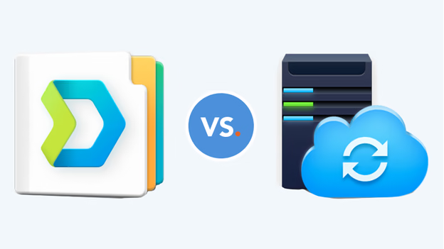
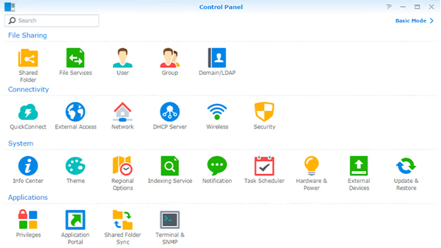
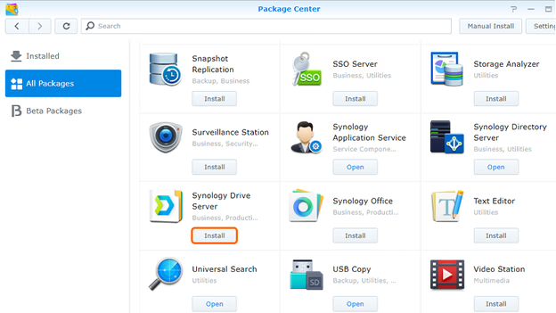
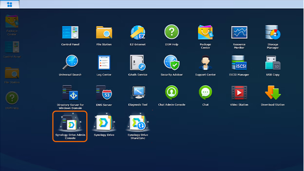
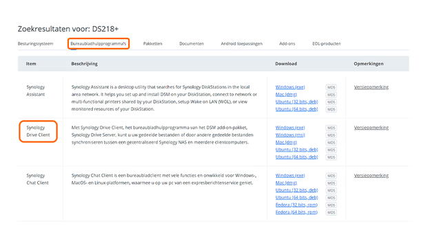
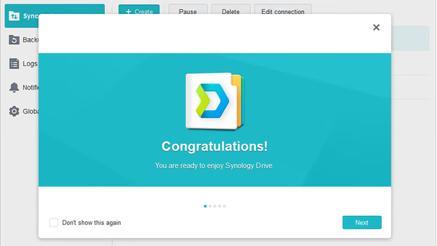

# Setting Up Synology Drive Server

Synology Drive Server enables you to create a private cloud, allowing seamless file synchronization and sharing across multiple devices. Follow this guide to install and configure Synology Drive Server on your NAS and connect it to your PC or laptop.

## Prerequisites

Before proceeding, ensure the following:

- **DSM Version**: Your Synology NAS is updated to the latest DSM version, or at least DSM 6.2.2. Check this via the Synology Control Panel under 'Update & Restore'.

- **Required Applications**: 'Universal Search' and 'Synology Application Service' are installed on your NAS. If not, download them from the Synology Package Center.

- **QuickConnect ID or IP Address**: Have your NAS's QuickConnect ID or IP address ready for later steps.

- **Computer Requirements**: Use a PC or laptop with an updated web browser such as Firefox, Chrome, Safari, or Internet Explorer 10.

## Step 1: Install Synology Drive Server on Your NAS

1. **Log In**: Access your Synology NAS through a web browser.

2. **Open Package Center**: In the DSM interface, navigate to the **Package Center**.

3. **Search for Drive**: Enter 'Drive' in the search bar or locate Synology Drive Server under 'All Packages'.

4. **Install**: Click 'Install' to download and install the application.

5. **Refresh Page**: Once the installation completes, click 'Open'. A prompt will appear asking to refresh the page; click 'Yes'. Synology Drive and Drive Admin Console are now installed on your NAS.

## Step 2: Enable Synchronization and Set Access Permissions

1. **Open Drive Admin Console**: Using your admin account, open Synology Drive Admin Console.

2. **Enable Team Folder**:
   - Navigate to the 'Team Folder' section.
   - Select the folder you wish to synchronize.
   - Click 'Enable' at the top; the status should turn green, indicating synchronization is active.

3. **Set Access Permissions**:
   - Go to the Synology Control Panel and select 'Shared Folder'.
   - Adjust read and write permissions for the selected folder as needed.
   - If necessary, navigate to the 'User' tab, select a user, click 'Edit', and assign specific access rights.
   - Click 'OK' to apply the changes.

## Step 3: Download Synology Drive Client to Your PC or Laptop

1. **Access Synology Download Center**:
   - On your computer, open a web browser and go to the [Synology Download Center](https://www.synology.com/en-us/support/download).
   - Select your NAS model.

2. **Download Drive Client**:
   - Navigate to the 'Desktop Utilities' tab.
   - Download 'Synology Drive Client' compatible with your operating system (Windows, Mac, or Ubuntu).

3. **Install the Client**:
   - Locate the downloaded installer in your downloads folder.
   - Run the installer, accept the terms and conditions, and complete the installation process.

## Step 4: Configure Synology Drive Client

1. **Launch Synology Drive Client**: After installation, open the Synology Drive Client application.

2. **Start Now**: Click 'Start Now' to begin the setup process.

3. **Connect to NAS**:
   - Enter your NAS's QuickConnect ID or IP address in the appropriate field.
   - Click the magnifying glass icon to search for your NAS.
   - Log in with your Synology username and password, then click 'Next'.

4. **Configure Sync Settings**:
   - In the 'Almost done!' screen, click the pencil icon next to 'Synology Drive Server'.
   - Select the Synology folder you wish to synchronize with your computer and click 'OK'.
   - To change the local folder, click the pencil icon next to 'Local Folder' and choose the desired directory on your computer.
   - Optional: Click 'Advanced' to exclude specific folders or file types from synchronization and to select the sync mode (download, upload, or bidirectional).
   - Click 'Next' to proceed.

5. **Enable 'Shared with Me' Sync (Optional)**: Choose whether to enable synchronization for files shared with you, then click 'Done'.

6. **Complete Setup**: You may take a virtual tour to familiarize yourself with Synology Drive or start using the application immediately.

By following these steps, you've successfully set up Synology Drive Server on your NAS and configured the client on your PC or laptop, enabling efficient file synchronization and access across your devices.
