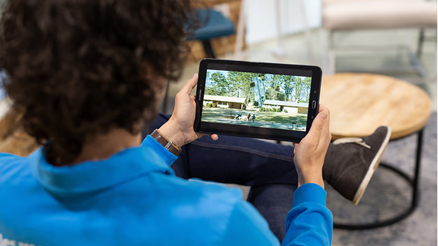
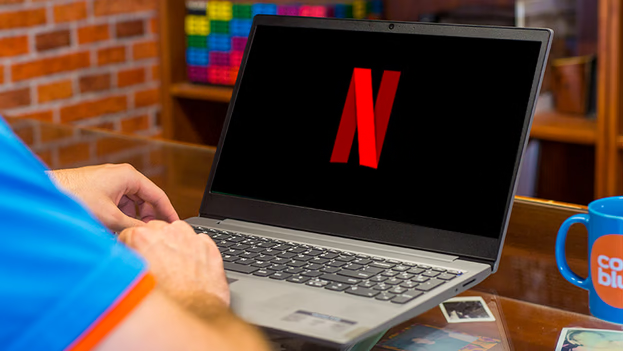
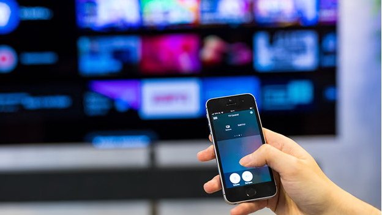
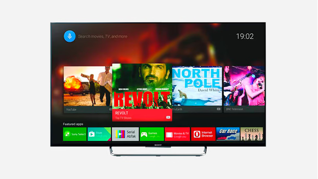
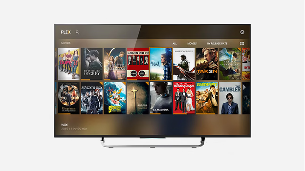
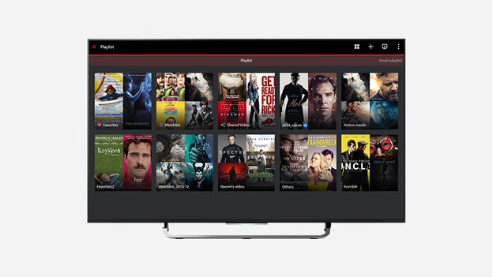

# Streaming Media with Your NAS

A Network Attached Storage (NAS) device serves as a centralized hub for storing and streaming your movies, series, and music across various devices, including smartphones, tablets, computers, and smart TVs. Here's how to effectively stream media from your NAS.

## Why Stream via a NAS?

Streaming from a NAS allows you to play videos on multiple devices without the need to store large files locally. This centralized storage ensures easy access and management of your media library. :contentReference[oaicite:0]{index=0}

## Viewing NAS Media on Your Smartphone and Tablet

NAS manufacturers offer dedicated apps for iOS and Android devices, enabling you to browse and play your media files seamlessly. Ensure your NAS supports transcoding to convert videos into compatible formats for smooth playback on your device. :contentReference[oaicite:1]{index=1}

**Suitable for:**

- iPhone, iPad, and Android smartphones and tablets

## Viewing NAS Media on Your Computer and Laptop

Access your NAS through your computer's file explorer to browse and play videos. Ensure you have a compatible media player installed to handle various video formats. :contentReference[oaicite:2]{index=2}

**Suitable for:**

- Windows and macOS

## Streaming NAS Media with Chromecast or Apple TV

With devices like Apple TV, Chromecast, or TVs with built-in Google Cast, you can stream videos directly from your NAS. Your NAS can transcode movies and series into supported formats for seamless viewing. :contentReference[oaicite:3]{index=3}

**Suitable for:**

- Apple TV
- Chromecast
- Televisions with Google Cast
- iPhone, iPad, and Android smartphones and tablets (as remote control)

## Streaming NAS Media with Android TV

Manufacturers like QNAP and Synology provide apps for Android TV, allowing direct access to your NAS-stored videos on your television. Android TV's broad format support ensures compatibility with most video files. :contentReference[oaicite:4]{index=4}

**Suitable for:**

- Smart TVs

## Streaming NAS Media with Plex

Plex is a popular streaming application that organizes your NAS media library by fetching metadata like actor information, subtitles, and cover art. It also transcodes unsupported video files, though this requires a powerful NAS due to the processing demands. :contentReference[oaicite:5]{index=5}

**Suitable for:**

- Smart TVs
- iPhone, iPad, and Android smartphones and tablets
- Windows and macOS
- PlayStation 4 and Xbox One

## Watching NAS Media on Your TV with DLNA

Most smart TVs come with DLNA support, enabling them to recognize your NAS as a media source. This allows you to navigate and play your video and photo files directly on your TV. However, not all TVs support every video format; using apps like Plex can help overcome these limitations. :contentReference[oaicite:6]{index=6}

**Suitable for:**

- Televisions with DLNA support

By leveraging these methods, you can enjoy your NAS-stored media across a variety of devices, ensuring a versatile and convenient entertainment experience.
