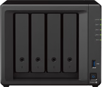
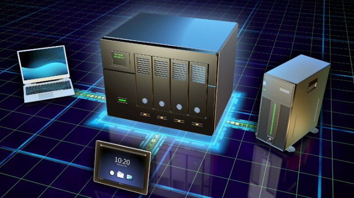
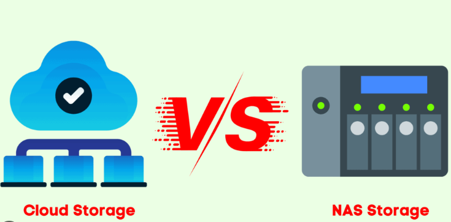
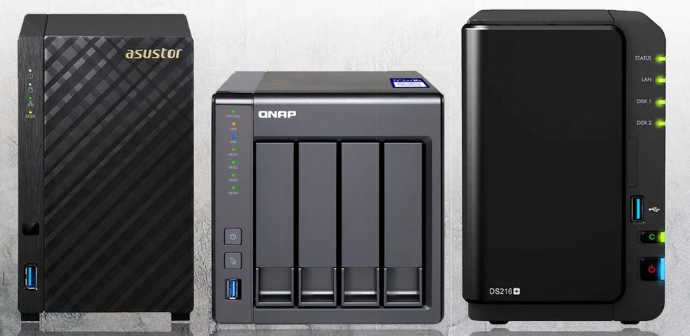
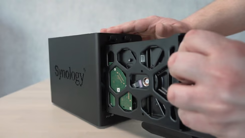
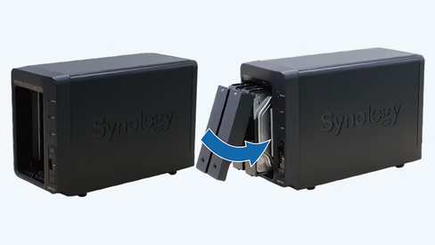
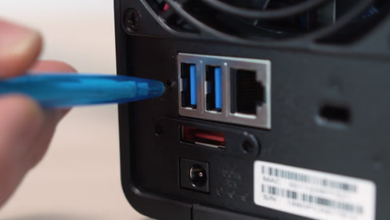

    <h1>Help with Synology DS923+</h1>
    

        
        

            <strong>Synology DS923+</strong> 
            Number of hard drive slots: 4 
            Suitable for hard drive size: 3.5-inch HDD, M.2 NVMe 
            Internal RAM: 4 GB 
            <a href="#">40 reviews</a>
        

    

    
Create a high-performance server and storage solution with the Synology DS923+. This NAS supports up to 4 hard drives, offering a total storage capacity of up to 108TB, allowing you to store hundreds of thousands of documents, analyses, and more on a reliable business server. Additionally, it features two M.2 slots to set up a fast cache memory, enabling quick access to your most-used files. Designed for teams of 10 or more users, the DS923+ is powered by the AMD Ryzen R1600 Dual-Core processor, delivering turbo speeds of up to 3.1GHz for seamless performance. With 4GB of RAM, you'll experience smooth multitasking with minimal slowdowns. Need more memory? The DS923+ supports up to 32GB of DDR4 RAM across two slots, providing an extra performance boost. This robust CPU and RAM combination makes the DS923+ ideal for 4K Plex streaming, ensuring you can enjoy your favorite movies and shows in cinema-quality resolution. Like all Synology NAS models, the DS923+ integrates with Synology Drive Server, allowing you to manage and edit your storage from any connected device.

    

        <h2>Introduction to NAS</h2>
        

            

                
                <a href="/nas/What-is-NAS.html">What is a NAS and Why Use a NAS?</a>
            

            

                
                <a href="/nas/NAS-CloudStorage.html">NAS vs. Cloud Storage</a>
            

            

                
                <a href="/nas/ChoosingtheRightNASforYourNeeds.html">Choosing the Right NAS for Your Needs</a>
            

        

    

    <h2>Resources for Using Synology NAS</h2>
    

        

            
            <h3>Help for Setup</h3>
            <ul>
                <li><a href="/nas/HowtoInstallYourSynologyNAS.html">How to Install Your Synology NAS</a></li>
                <li><a href="/nas/InstallingPlexonYourSynologyNAS.html">Installing Plex on Your Synology NAS</a></li>
                <li><a href="/nas/SettingUpSynologyDriveServer.html">Setting Up Synology Drive Server</a></li>
                <li><a href="/nas/RecordingIPCameraFootagewithYourSynologyNAS.html">Recording IP Camera Footage with Your Synology NAS</a></li>
            </ul>
        

        

            
            <h3>Help for Use</h3>
            <ul>
                <li><a href="/nas/HowtoTransferHardDrivesBetweenSynologyNASDevices.html">How to Transfer Hard Drives Between Synology NAS Devices</a></li>
                <li><a href="/nas/AccessingYourSynologyNASExternallyviaQuickConnect.html">Accessing Your Synology NAS Externally via QuickConnect</a></li>
                <li><a href="/nas/StreamingMediawithYourNAS.html">Streaming Media with Your NAS</a></li>
            </ul>
        

        

            
            <h3>Help for Troubleshooting</h3>
            <ul>
                <li><a href="/nas/How-to-reset-your-Synology-NAS.html">How to Reset Your Synology NAS</a></li>
                <li><a href="/nas/AdjustingtheRAIDSetuponYourSynologyNAS.html">Adjusting the RAID Setup on Your Synology NAS</a></li>
            </ul>
        

    

    <h2>Suitable Accessories for Synology DS923+</h2>
    

<h3>Memory</h3><ul style="list-style-type: none; padding-left: 0px;"><li style="margin-bottom: 10px;"><a href="https://www.newegg.com/crucial-16gb-260-pin-ddr4-so-dimm/p/0RN-0005-008N2?Item=9SIAWKTK1F6419" style="text-decoration: none; color: rgb(42, 93, 132);">Crucial 16GB DDR4 2666 (PC4-21300) CL19 ECC Unbuffered SODIMM CT16G4TFD8266</a>$50.09</li><li style="margin-bottom: 10px;"><a href="https://www.newegg.com/kingston-16gb/p/1B4-00M4-003Y3?Item=9SIA24GK8V1385" style="text-decoration: none; color: rgb(42, 93, 132);">Kingston 16GB 2666MHz DDR4 ECC CL19 SODIMM 2Rx8 Hynix D KSM26SED8 16HD</a>$65.93</li><li style="margin-bottom: 10px;"><a href="https://www.newegg.com/avarum-16gb/p/1X5-00CY-00NS6?Item=9SIAD8UK6P6367" style="text-decoration: none; color: rgb(42, 93, 132);">AVARUM RAM 16GB DDR4-2933 PC4-23400 1Rx4 ECC Registered Memory</a>$41.41</li></ul>

<h3>Hard Disks</h3><ul style="list-style-type: none; padding-left: 0px;"><li style="margin-bottom: 10px;"><a href="https://www.newegg.com/seagate-ironwolf-st14000vn0008-14tb/p/N82E16822184759" style="text-decoration: none; color: rgb(42, 93, 132);">Seagate IronWolf 14TB NAS Hard Drive 7200 RPM 256MB Cache SATA 6.0Gb/s CMR 3.5" Internal HDD for RAID Network Attached Storage ST14000VN0008</a>$200.48</li><li style="margin-bottom: 10px;"><a href="https://www.newegg.com/seagate-ironwolf-st16000vn001-16tb/p/N82E16822184805" style="text-decoration: none; color: rgb(42, 93, 132);">Seagate IronWolf 16TB NAS Hard Drive 7200 RPM 256MB Cache SATA 6.0Gb/s CMR 3.5" Internal HDD for RAID Network Attached Storage ST16000VN001</a>$241.77</li><li style="margin-bottom: 10px;"><a href="https://www.newegg.com/seagate-ironwolf-pro-st12000ne0008-2jl101-500-12tb/p/1Z4-002P-022K0" style="text-decoration: none; color: rgb(42, 93, 132);">Refurbished Seagate IronWolf Pro 12TB SATA 6Gb/s 7200RPM 3.5-Inch NAS HDD (ST12000NE0008)</a>$193.99</li></ul>

<h3>SSDs</h3><ul style="list-style-type: none; padding-left: 0px;"><li style="margin-bottom: 10px;"><a href="https://www.newegg.com/aitc-kingsman-2tb-km600/p/0D9-00ZF-00014?Item=9SIBDCSJJY6194" style="text-decoration: none; color: rgb(42, 93, 132);">AITC KINGSMAN KM600 ULTRA M.2 2280 2TB PCIe 3.0 x4 with NVMe 1.4 3D NAND Internal Solid State Drive (SSD)</a>$86.99</li><li style="margin-bottom: 10px;"><a href="https://www.newegg.com/kingspec-1tb-ne-series/p/0D9-000D-00123?Item=9SIB1V8FH29221" style="text-decoration: none; color: rgb(42, 93, 132);">KingSpec M2 SSD NVMe 1TB M.2 2280 PCIe Gen 3.0X4 SSD Internal Solid State Drive Computer Disk Data Storage NAND Flash Hard Drives PC Desktop Laptop Ultrabook</a>$47.99</li><li style="margin-bottom: 10px;"><a href="https://www.newegg.com/kingspec-2tb/p/0D9-000D-00151?Item=9SIB1V8HP68401" style="text-decoration: none; color: rgb(42, 93, 132);">KingSpec SSD 2TB Internal Solid State Drive M.2 NVMe 2280 PCIe  3.0X4 Computer Disk Data Storage NAND Flash Hard Drives PC Desktop Laptop Ultrabook Upgrade for CoRe Ryzen Motherboard</a>$92.99</li></ul>

    

